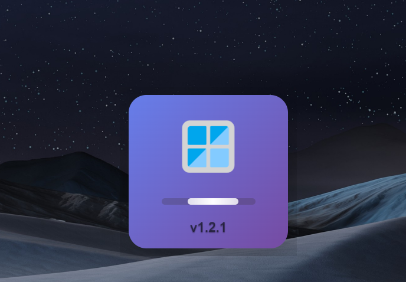
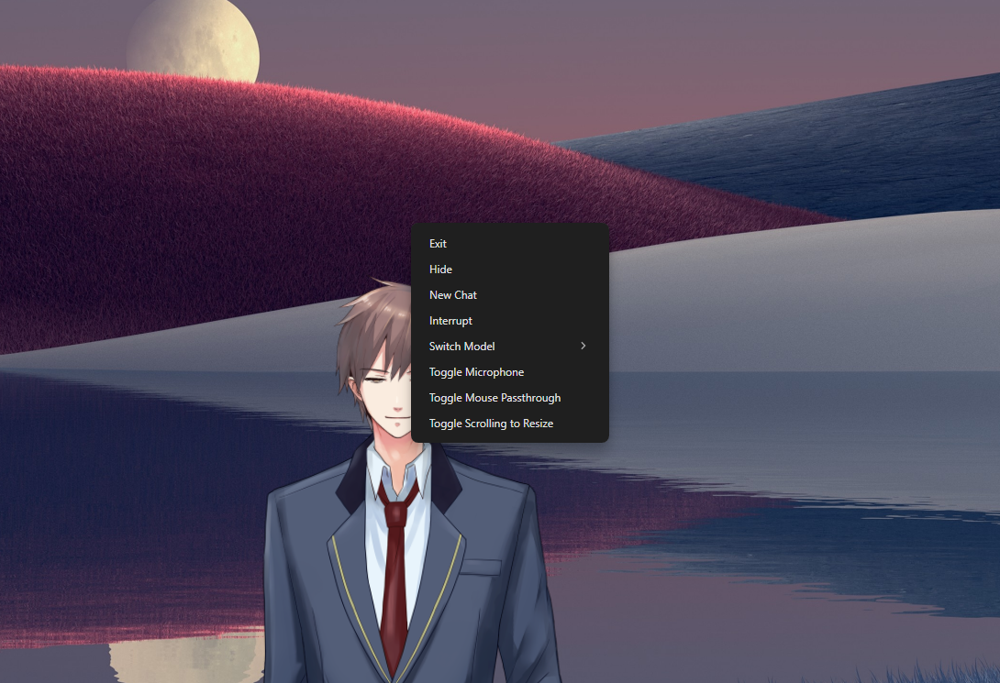

# 🤖 Talking Ai Model — AI VTuber Application - 🎤 !

An AI-powered **VTuber / Talking Avatar** application with real-time voice interaction, built using **Electron + Python**, featuring Live2D animation, speech recognition, text-to-speech, and LLM integration.

---

## ✨ Demo & Screenshots

### 🎬 Live Demo 
<p align="center">
  
</p>

---

### 🪟 Application Screenshots

<table align="center">
  <tr>
    <th>🧑‍🚀 Home</th>
    <th>🙋‍♂️ Disk</th>
    <th>🎡 XP</th>
  </tr>
  <tr>
    <td></td>
    <td></td>
    <td></td>
  </tr>
</table>

---

### 🛠️ System & Permissions

<table align="center">
  <tr>
    <th>✨ Elevated ✨</th>
    <th>✨ System ✨</th>
  </tr>
  <tr>
    <td></td>
    <td></td>
  </tr>
</table>

---

## 🧠 Overview

**Talking Avatar** is a desktop AI VTuber system that allows users to interact with a virtual character using natural voice conversations.

The system runs mostly **locally**, is optimized for **low resource usage**, and supports **Live2D animated avatars** with real-time speech and system tools.

---

---

## 🚀 Quick Start

### Start Development

```bash
npm run dev


``
┌─────────────────────────────────────┐
│ Components:                         │
│ • LLM: GitHub Models (gpt-4o-mini)  │
│ • ASR: Whisper.cpp (tiny.en)        │
│ • TTS: Edge TTS (Free)              │
│ • Live2D: Character Animation       │
│ • MCP Tools: time, useWinTerminal   │
└─────────────────────────────────────┘

``


    "deepwiki": {
      "serverUrl": "https://mcp.deepwiki.com/sse"
    }


    


        "windowsIntegration": {
      "command": "uvx",
      "args": [
        "windows-mcp"
      ],
      "env": {
        "CURL_CA_BUNDLE": "",
        "REQUESTS_CA_BUNDLE": "",
        "PYTHONHTTPSVERIFY": "0",
        "POSTHOG_DISABLED": "true"
      }
    }


    https://mcpservers.org/servers/VectorInstitute/mcp-goodnews


    https://mcpservers.org/servers/docs-testdino-com-testdino-mcp-overview